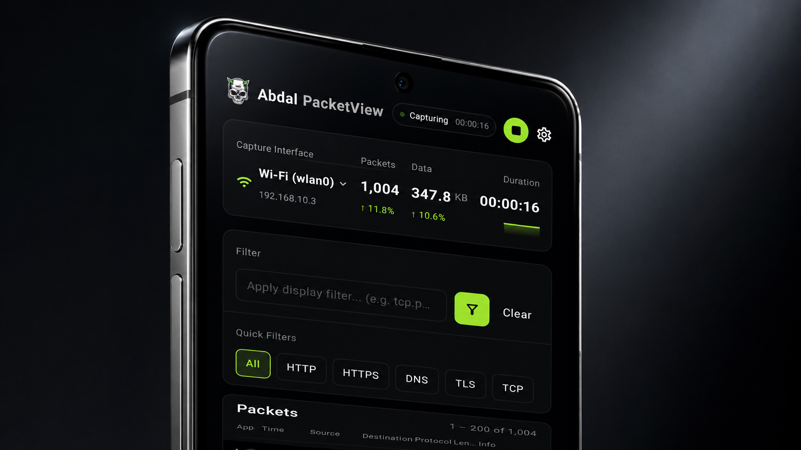

# 📡 Abdal PacketView - Android Packet Capture, Network Traffic Analyzer and PCAPNG Export Tool


<p align="center">
  <a href="README.md">🇺🇸 English</a> |
  <a href="README.fa.md">🇮🇷 فارسی</a>
</p>

<p align="center">
  
</p>


> Capture, inspect and export Android network packets directly on-device — no root, no external server and no desktop proxy required.

<p align="center">
  
  
  
  
  
  
</p>

## 🚀 Introduction

**Abdal PacketView** is an Android network packet capture and traffic analysis tool designed to help users understand what their device sends and receives over the network.

It turns an Android device into a local packet analyzer by using Android `VpnService` to create a local TUN interface, capture raw IP packets, decode network metadata and save captures in the modern **PCAPNG** format for tools such as Wireshark and tshark.

The application is built for security researchers, Android developers, QA engineers, network analysts and advanced users who need practical visibility into their own device traffic without rooting the device.

## ❓ Why This Project Exists

Analyzing Android network traffic usually requires a rooted device, a desktop setup, Wireshark, proxies, USB routing or complex network configuration. This workflow is slow, fragile and difficult for many users.

**Abdal PacketView** was created to make Android packet inspection more accessible by providing a local, user-controlled and on-device capture workflow. It helps users inspect traffic, attribute packets to apps and export clean capture files for deeper analysis.

## ✨ Key Features

- 🛰️ **On-device packet capture** using Android `VpnService` and a local TUN interface
- 🔐 **No root required** and no external capture server
- 🔌 **Internet connectivity preservation** while capture is active
- 🧬 **Packet decoding** for IPv4, IPv6, TCP, UDP and ICMP traffic
- 🏷️ **App attribution** based on UID, with app name and package name attached to captured packets
- 🧭 **App Split Tunnel** with Route via Tunnel and Bypass Tunnel modes
- 🔎 **Wireshark-style display filters** for protocols, fields, ports, packet length and Boolean logic
- 💾 **PCAPNG export** inside a ZIP package with `statistics.json`
- 📊 **Session statistics** including packet count, captured data size, duration and App Split state
- ⚡ **Performance options** such as analysis forwarding separation, LRU attribution cache and memory optimization
- 📚 **Built-in Help Center** for display filter guidance
- 🧠 **Proto Tuts+** knowledge base for protocol and cybersecurity concepts
- 🌙 **Modern dark UI** built with Jetpack Compose and RTL support

## 🧩 Use Cases

- 🔍 Inspect Android app network behavior during development or testing
- 🛡️ Analyze suspicious or unexpected network activity on your own device
- 🧪 Debug API traffic, DNS behavior, QUIC, HTTPS and UDP flows
- 📦 Export packet captures for Wireshark, tshark or external reporting
- 🧭 Compare traffic between selected apps using App Split filtering
- 📚 Learn network protocols with practical on-device captures

## 📦 Output Format

When a capture is saved, **Abdal PacketView** creates a ZIP package that contains:

```text
Abdal_PacketView_<timestamp>.pcapng
statistics.json
```

The `.pcapng` file is compatible with Wireshark and tshark. Each packet can include app attribution metadata such as the app name and package name. The `statistics.json` file stores a readable summary of the capture session, including packet count, data size, duration, generation time and active App Split mode.

The project also uses custom PCAPNG options identified under the IANA Private Enterprise Number **66033** registered for **Abdal Security Group**.


## ▶️ Usage

1. Open the app and go to the **Capture** tab.
2. Tap **Start** and approve the Android VPN consent dialog.
3. Use your Android device normally while packets appear in the live capture table.
4. Tap a packet row to inspect decoded details.
5. Use **App Split** to capture only selected apps or bypass selected apps.
6. Apply display filters such as:

```text
https
udp && port == 53
ip.addr == 8.8.8.8
```

7. Tap **Save Capture** to generate a ZIP package containing the `.pcapng` capture and `statistics.json`.
8. Share the exported file with Wireshark, tshark or another analysis workflow.


## 🐛 Reporting Issues

If you encounter any issues or have configuration problems, please reach out via email at Prof.Shafiei@Gmail.com. You can also report issues on GitLab or GitHub.

## ❤️ Donation

If you find this project helpful and would like to support further development, please consider making a donation:

- [Donate Here](https://t.me/AbdalDonationBot)

## 🤵 Programmer

Handcrafted with Passion by **Ebrahim Shafiei (EbraSha)**

- **E-Mail**: Prof.Shafiei@Gmail.com
- **Telegram**: [@ProfShafiei](https://t.me/ProfShafiei)

## 📜 License

This project is licensed under the AGPLv3 License.
